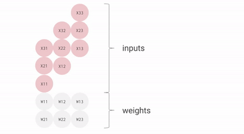

# TPU General
This is for general information, useful in describing the TPU.

## Components
- Matrix Multiplier Unit (MXU)
  - 65,536(256*256) 8-bit multiply-and-add units for matrix operations
- Unified Buffer (UB)
  - 24MB of SRAM that work as registers
- Activation Unit (AU)
  - Hardwired activation functions
    

_TPU block diagram_

# Topics of interest
This is a  comprehensive list of topics covered in CSC 411. The idea is that during our research, we will fill in information under the topics that we come across as they relate to TPUs.
The purpose of this document is to show, as much as we possibly can, how our understanding of TPUs also shows a complete understanding of material covered in CSC 411.

## Number Systems
- 
## Bitwise Operations
- 
## Integers (signed and unsigned, representing data as bits)
- 
## Debugging(gdb)
- Debugging specialized processors like TPUs requires understanding their instruction flow and behavior under different workloads. Debugging tools are used to trace operations at the binary level. For example, analyzing TPU performance involves profiling individual matrix operations and their interaction with memory hierarchies. These tasks parallel debugging C programs with tools like GDB, as discussed in the lecture slides
## Memory 
- 
### Casting Integer Values
- 
### Byte ordering
- TPUs use big endian
### Pointers
- 
## Floating Point Number Representation
- 
### IEEE Standard
- 
## Computer Systems
- TPUs exemplify the design principles of domain-specific processors. Unlike CPUs or GPUs, which are general-purpose, TPUs are tailored for neural network inference.
### High Performance Computing
- 
### Abstractions
- 
### Instruction Set Architecture (ISA)
- TPUs use a simplified instruction set closer to the RISC (Reduced Instruction Set Computer) philosophy. This streamlined instruction set minimizes decoding complexity and maximizes execution efficiency.
### Chip Manufacturing
- 
## RISC-V
- Although the simplicity of CPUs running with RISC-V ISAs allows for clock speeds in the GHz range, large matrices of operations can greatly slow down these processors.
- TPUs utilizes CISC (Complex Instruction Set Computer) because this architechture favors executing high-complexity tasks with each instruction.
## Executing Instructions
- To speed up large matrix operations, RISC-V processors are able to preform vector processing, where operations are applied to an entire vector in parallel. This is commonly found in Graphics Processing Units (GPUs).
- The TPU takes this idea a step further, allowing for parallel matrix processing. This means that a TPU has the ability to preform an operation on a large matrix, all at the same time. This jurastically reduces execution time compared to the scalar processing of CPUs.
### Executing Memory Instructions
- 
### RISC-V Procedures
- 
## Representing Instructions
- 
### Control Instructions
- 
## Compiling, Interpreting, Running Programs
- 
### Compiling and Linking
- 
### Loading
- 
### Interpreters
- 
### Impacts on Performance
- 
### Optimization 
- The TPU features a large (28 MB) on-chip memory to minimize latency from accessing external memory. This design reflects the importance of efficient memory hierarchy in computer architecture.
- With performance per watt being 30–80 times higher than contemporary CPUs and GPUs, TPUs exemplify the trade-offs between general-purpose flexibility and domain-specific efficiency [reference](https://cloud.google.com/blog/products/ai-machine-learning/an-in-depth-look-at-googles-first-tensor-processing-unit-tpu)
  

_Performance per Watt Comparison: CPU, GPU, and TPU_

## Performance
- 
### Amdahl's Law
- 
### Measuring Performance
- 
## Logic Design
- 
### Transistors
- 
### Digtial Logic
- 
## Boolean Algebra
- 
### Logic Circuits
- 
### Decoders
- 
### Multiplexers
- 
## Adders and ALUs
- 
### Adders
- 
### ALUs
- An Arithmetic Logic Unit (ALU) is essential for processing instructions. An ALU reads a binary input, and uses logic gates and arithmatic circuits to produces binary outputs. CPUs, GPUs, and TPUs all use ALUs. However, the TPU uses it much differently and more efficiently than the others.
- A CPU utilizes registers for loading and storing values, while the ALU is instructed operations for which register to read from, and which to write to.
  - This organization method is useful for general-purpose computing, however the large number of registers and ALUs are both cost and power intensive.

    
    
    _General flow of read/operate/write in CPUs_
    
- The Matrix Multiplier Unit (MXU) in a TPU implements ALUs in a systolic array, rather than the more common Von Neumann architecture.
  - A systolic array describes a homogenous network of tightly packed Data processing Units (DPUs). Each of these DPUs are called cells or nodes. Each node computes a piece of the output based on the data recieved from its upstream neighboring nodes, stores the partial result within itself, then passes it downstream. This flow of data goes through a network of hard-wired processor nodes that combine, process, merge, and sort the input data into the desired result.
    - This wave-like propogation of data makes it ideal for the operations of the TPU.
  - The use of the systolic array veers from the mainstream ideas of the Von Neumann architechture. Also, Amdahl's Law is not applied in the same way, due to the fact that you cannot optimize a singular 'part' of the systolic array, nor can you measure how long this 'part' is used, because of the parallel flow of data and the interconnectivity of nodes.
    - [Reference](https://en.wikipedia.org/wiki/Systolic_array)

- A TPU reads inputs in such a way that it only needs to read each input once, and access them many times for different operations. This eliminates the need for loading and storing values into registers, thus greatly decreasing cost, power, and size of the unit.
- Additionally, the lack of registers allows for ALUs to be more energy efficient, as they only connect to other adjacent ALUs.
- The implementation of the systolic array is optimized for power and area efficiency, and is tailored specifically for matrix operations.

  
  
  _Matrix multiplication of an input matrix by a weight matrix in asystolic array_

  Because of this, there are some tradeoffs in exchange for the efficiency and operation density of the TPU:
  - Limited registers
  - Operational and control flexibility
- These tradeoffs make TPUs not suitable for everyday use compared to CPUs.
### Delays
- 
# Conclusion

The study of TPUs through the lens of computer organization highlights the relevance of foundational principles like number systems, Boolean algebra, and processor design in addressing real-world computational challenges. By focusing on domain-specific needs, TPUs achieve unparalleled efficiency in machine learning, making them a benchmark for future hardware innovations.

## 

## 

## 

